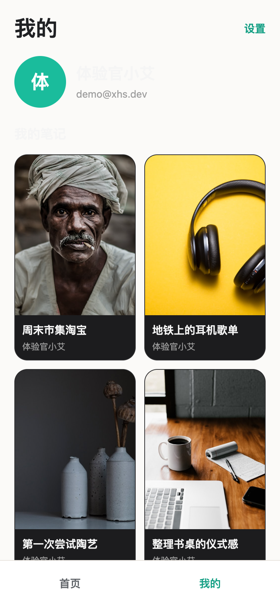

# xhs

小红书风格内容社区 App（作品集向）—— Expo（iOS + Android + Web 同源托管）+ Hono on Cloudflare Workers + D1 + R2 + better-auth + oRPC + Drizzle + Alchemy，Bun monorepo（Turbo）。

> 权威需求与进度：`docs/specs/v1-portfolio-app/`（requirements / spec / plan / workflow-state）。
> 当前状态：P0–P7 已实现并部署；Web 静态产物与 API 同源托管于同一 Worker，种子笔记已换成真实照片（Unsplash 授权），提供体验账号与 Android 安装包（v1.1.0）。

## 在线体验

| 入口 | 地址 |
| --- | --- |
| Web 版 | https://xhs-server.0624afe1.workers.dev |
| Android 安装包 | GitHub Releases → [xhs-android-v1.1.0.apk](https://github.com/pzzyf/xhs/releases) |
| 体验账号 | `demo@xhs.dev` / `demo123456`（Web 与 Android 均可登录） |

截图（Web 版线上实拍，390×844 视口）：

| 首页 | 笔记详情 | 我的 |
| --- | --- | --- |
|  |  |  |

安装 Android 版：下载 APK 后安装时需允许「安装未知来源应用」；应用直连公网 API（依赖可访问 `*.workers.dev` 的网络）。

iOS 暂不提供安装包：可用 Web 版体验，或本地 `bun run dev:native` 用 Expo Go 打开。

注意：`*.workers.dev` 在部分网络（如中国大陆直连）不可达，此时 Web 与 Android 均无法访问线上 API。

## 仓库结构

```text
apps/
  native/          Expo Router 客户端（iOS + Android + Web 静态导出 dist/）
  server/          Hono Worker（唯一入口 src/worker.ts，同源托管 Web 静态产物）
packages/
  api/             oRPC contract + Zod（Native/Server 共用契约）
  auth/            better-auth 配置工厂
  db/              Drizzle schema / migrations / seed / 精选种子照片（seed-photos/）
  env/             native + server 环境变量校验（Zod）
  infra/           alchemy.run.ts：D1 + R2 + Worker 唯一真相源
  config/          共享 tsconfig
docs/specs/v1-portfolio-app/   需求 / 规格 / 计划 / 工作流状态
docs/screenshots/              Web 版线上截图
```

## 技术栈

- Bun workspaces + Turborepo + Biome + Lefthook
- 客户端：Expo SDK 57（Expo Router）+ HeroUI Native + Uniwind + TanStack Query
- 服务端：Hono on Cloudflare Workers，鉴权 better-auth（邮箱+密码）
- 存储：D1（Drizzle ORM）+ R2（笔记图片；种子照片为 Unsplash 授权精选）
- 部署：Alchemy（唯一 IaC 声明；Web 静态产物随 Worker 同源部署）

## 本地开发

前置：Bun ≥ 1.3，Cloudflare 账号凭据（部署时才需要）。

```bash
bun install

# 服务端（Alchemy 本地 runtime，D1/R2 绑定 + Worker @ :3000）
cp apps/server/.env.example apps/server/.env   # 填入 BETTER_AUTH_SECRET、SEED_SECRET 等
bun run dev:server
curl http://localhost:3000/                    # 健康检查

# 种子数据（幂等：demo 用户+密码 + 16 条中文笔记）
curl -X POST http://localhost:3000/api/dev/seed -H "x-seed-secret: <SEED_SECRET>"

# 精选真实照片上传（覆盖渐变占位图；本地/线上通用）
bun run seed:images [serverUrl]                # 默认 http://localhost:3000

# 客户端（Expo 开发模式）
cp apps/native/.env.example apps/native/.env   # EXPO_PUBLIC_SERVER_URL 指向服务端
bun run dev:native                             # Web: http://localhost:8081

# Web 静态产物（同源部署用；构建时内联 EXPO_PUBLIC_SERVER_URL，需先写入 apps/native/.env）
bun run build:web
```

## 常用命令

```bash
bun run check-types            # 全仓类型检查（Turbo）
bun run check                  # Biome 格式化 + Lint（scoped 修改文件用 bunx biome check <files>）
bunx expo install --check      #（apps/native）校验 Expo 依赖对齐
bun run alchemy:plan           # 查看 Cloudflare 资源变更计划
bun run alchemy:deploy -- --yes  # 部署 Worker（含静态资源）+ D1 + R2 到公网
```

## 部署

```bash
# 1. Web 静态产物：先写 apps/native/.env（EXPO_PUBLIC_SERVER_URL=公网 URL）再导出
bun run build:web
grep -l "xhs-server.0624afe1.workers.dev" apps/native/dist/_expo/static/js/web/*.js  # 校验内联 URL

# 2. Cloudflare 凭据与业务变量（不入库）
cp packages/infra/.env.example packages/infra/.env  # Cloudflare 凭据
# apps/server/.env 中 CORS_ORIGINS 需包含公网 URL（better-auth 校验 POST 的 Origin）

# 3. 部署 + 线上种子
bun run alchemy:plan && bun run alchemy:deploy -- --yes
curl -X POST https://xhs-server.0624afe1.workers.dev/api/dev/seed -H "x-seed-secret: <SEED_SECRET>"
bun run seed:images -- https://xhs-server.0624afe1.workers.dev
```

- 当前线上地址：`https://xhs-server.0624afe1.workers.dev`（Worker 同源托管 Web 静态产物 + API；D1/R2 已按种子重建并写入体验账号）
- ⚠️ 数据风险：`alchemy dev` 会在云端状态记录 `local` 模式，紧接着执行 `alchemy deploy` 会触发破坏性替换（删除并重建 D1/R2，丢失线上数据）。日常流程保持「部署用 deploy、开发用 dev」分离；若发现 `alchemy plan` 出现 `replace (local → live)`，先确认是否愿意重置数据，部署后务必重跑 seed 与 seed:images。

## 线上验收剧本

`docs/specs/v1-portfolio-app/requirements.md` §4 的 AC-01…AC-10 已于 P7 本地与线上（经代理）全量走通；v1.1.0 起 Web 与 API 同源，已对公网直连复验：首页/深链 `/note/:id`/demo 登录/详情/我的/点赞/发布全链路通过（headless Chrome 线上实拍，控制台 0 error）；Android release APK 在模拟器安装启动无崩溃（此前 P7 的 Expo Go 原生验收亦打到同一线上 API）。注意：直连 `*.workers.dev` 在部分网络不可达。

## Android 安装包构建（v1.1.0）

```bash
cd apps/native
bunx expo prebuild --platform android --no-install   # 生成 android/（gitignore）
keytool -genkeypair -keystore android/app/keystore.jks -alias xhs -keyalg RSA -keysize 2048 -validity 10950
# android/app/build.gradle：release 签名指向 keystore.jks（本仓库已配置）
cd android
./gradlew :app:assembleRelease --no-daemon           # --no-daemon：daemon PATH 缺 node 时 autolinking 失效
```

- 产物：`android/app/build/outputs/apk/release/app-release.apk`
- 本机签名密钥：`android/app/keystore.jks`（密码 `xhs-demo-keystore`，仅演示用途；正式发布请更换）
- 已知环境坑：gradle daemon 的 PATH 不含 `node` 时 expo autolinking 静默返回 0 模块（APK 缺原生模块，启动即崩），需 `--no-daemon` 或确保 daemon 环境有 node；NDK 27 + macOS 上 `gradlew clean` 的 CMake 阶段会因 `-fuse-ld=gold` 失败，重建时删 `app/build` 即可。

## 安全与约定

- 真密钥只放各 `.env`（已 gitignore），仅提交 `.env.example`；禁止把密钥放进 `EXPO_PUBLIC_*`
- 提交由用户显式发起；不 force push；不绕过 Lefthook hooks
- 不引入 Kysely / 评论 / 搜索 / AI / 双轨 IaC（详见需求非目标）
- 种子照片来自 Unsplash（License 与来源见 `packages/db/seed-photos/UNSPLASH.md`）
